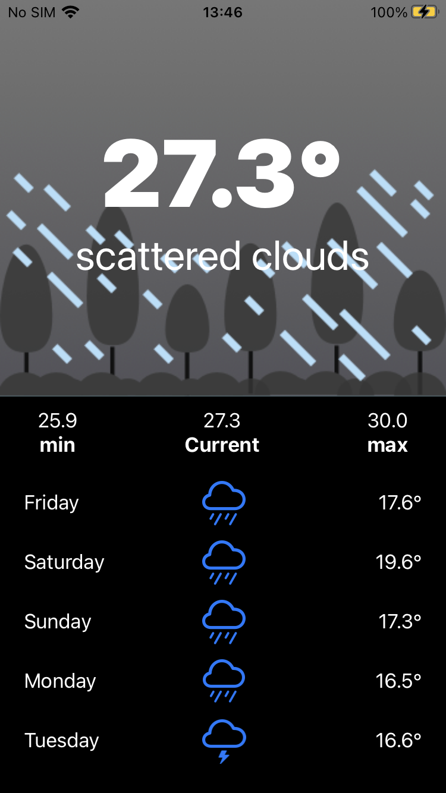

# MobileWeather
An app designed to calculator the tip amount for a bill. The user has the ability to enter the total bill amount, select a tip percentage and then choose how many people the bill will be split with. The total amount will be shown when tapping on calculate.

### What was learnt
- MVC Design Pattern
- StoryBoards
- UIKit
- Creating and linking multiple View Controllers
- Creating and linking IBOutlets and IBActions
- Creating and mutating structs

## Home

